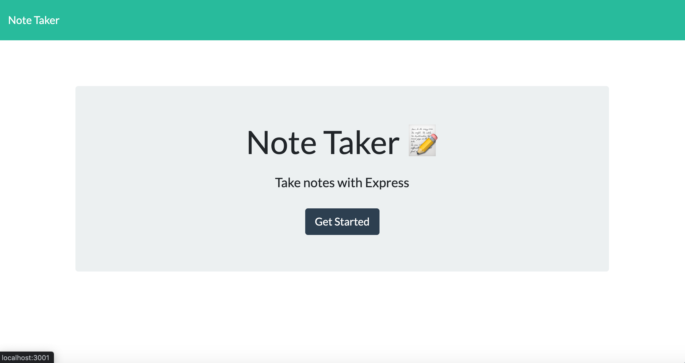
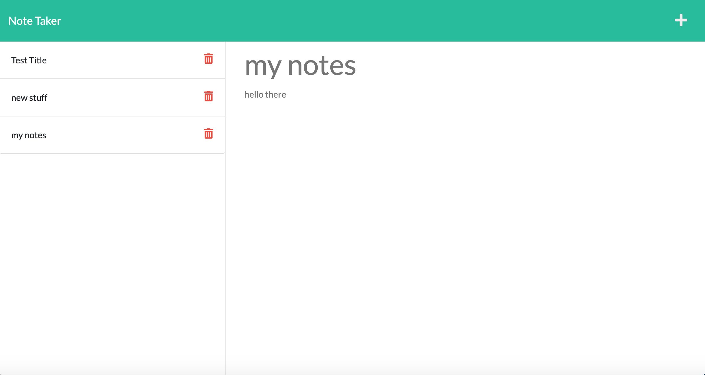

# Note_Taker_App

## Summary
This application allows the user to add notes into the application and have the option to save 
them so that the content can be stored and opened at the users request. the saved notes remain after the 
application is closed or refreshed. This application uses express.js on the back end which allows the application to make GET, POST, and DELETE requests. 

## Technologies 
* JavaScript
* HTML
* CSS
* Node.js
* Express.js

## installation
Node.js must be installed. Install Express.js and other needed dependencies by inputting "npm i" in the terminal.

## Usage
once node is installed type "node server.js" to run the server. you will be given a link (localhost:3001) that can be opened in browser
to display the application. once the application is displayed, it will allow the user to type in a text box and title box which can then be saved to be opened for later use.

## Preview 

